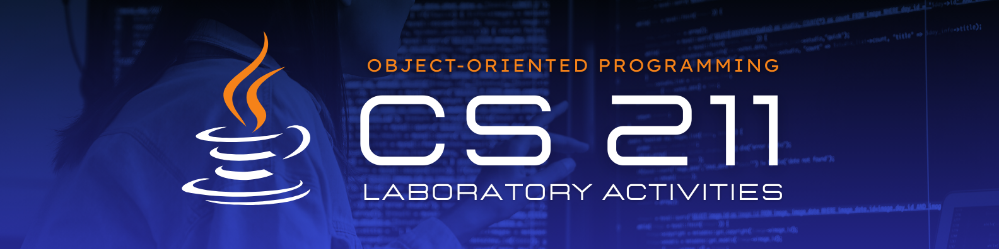
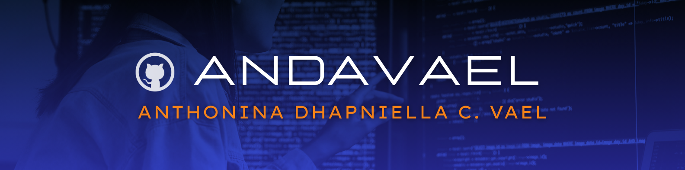

   

# 💻 CS 211 - Laboratory Activities 

Welcome to the **CS 211 - Laboratory Activities repository**! This collection showcases hands-on outputs from the Object-Oriented Programming (OOP) course, featuring practical implementations of fundamental **OOP concepts and principles** in Java. Whether you're seeking inspiration, reference material, or a deeper understanding of OOP, this repository is a valuable resource for students and developers alike.

Dive in and explore the basics of object-oriented programming through real-world coding examples!☕

---
## 🗂️ **Repository Index**
&nbsp;&nbsp;&nbsp;&nbsp; ☕ [**Laboratory Activity 1**](#lab1)  
&nbsp;&nbsp;&nbsp;&nbsp; ☕ [**Laboratory Activity 2**](#lab2)  
&nbsp;&nbsp;&nbsp;&nbsp; ☕ [**Laboratory Activity 3**](#lab3)  
&nbsp;&nbsp;&nbsp;&nbsp; ☕ [**Laboratory Activity 4**](#lab4)

---

## <a id="lab1"> 🖥️ Laboratory Activity 1 </a>

####  *Overview*  
This activity introduces fundamental programming concepts in Java through hands-on exercises. It focuses on user input handling, formatting outputs, and understanding key Java concepts such as type casting and escape sequences. The tasks involve comparing characters and collecting song details from users while ensuring efficient memory usage. This activity covers **Introduction to Java**, which serves as the foundation for the exercises and concepts explored.

#### *📂 Files Included*  

| **File**               | **Description**                                                                                 |
|------------------------|---------------------------------------------------------------------------------------------|
| **GettingGreater.java** | A program that compares two characters input by the user and displays the one with the greater ASCII value, along with their corresponding ASCII codes.  |
| **GettingInputs.java**  | A program that prompts the user to input details about a song (year, genre, album, title, artist) and displays the formatted song information. |

#### *🎯 Objectives*  

1. **Efficiently Use the `Scanner` Class**  
   > Master the art of taking user inputs with the `Scanner` class, and ensure proper resource management by closing the scanner to avoid memory leaks and keep your code efficient.

2. **Use Escape Sequences Efficiently**  
   > Learn to wield escape sequences like `\n` and `\"` for neat and professional string formatting, giving your outputs a clear and organized structure.

3. **Properly Implement Type Casting**  
   > Dive into type casting to smoothly convert between data types in Java, ensuring that your program handles inputs and outputs accurately, without losing data or causing errors.

 

---

## <a id="lab2"> 🖥️ Laboratory Activity 2 </a>
####  *Overview*  
This activity explores core programming concepts in Java through engaging exercises. It focuses on flow control, arrays, and functions to help you develop a deeper understanding of how to manipulate data and perform operations on arrays. This activity covers **Java Flow Control, Arrays, and Functions**, laying the groundwork for more advanced topics in programming.

#### *📂 Files Included*  

| **File**                    | **Description**                                                                                  |
|-----------------------------|--------------------------------------------------------------------------------------------------|
| **GetArrayMean.java**        | A Java program that calculates and displays the mean of an array of integers entered by the user. |
| **MultiplicationTable.java** | A Java program that generates and displays a multiplication table of a specified size, based on user input. |

#### *🎯 Objectives*  

1. **Proper Implementation of Functions**  
   > Learn how to implement functions to perform specific operations and display outputs effectively.

2. **Use of Loops**  
   > Gain proficiency in using loops for iterating over data structures like arrays to perform repetitive tasks, such as calculating sums or generating patterns.

3. **Array Conventions**  
   > Understand the conventions for defining and using arrays in Java, including indexing, iteration, and performing operations like calculating the mean.

 

---

## <a id="lab3"> 🖥️ Laboratory Activity 3 </a>
####  *Overview*  
This activity delves into advanced object-oriented programming concepts in Java. It focuses on **Encapsulation**, **Inheritance**, and **Polymorphism**, providing a deeper understanding of how to design flexible and reusable code. This activity covers key OOP principles, which are essential for writing maintainable and scalable Java applications.

#### *📂 Files Included*  

| **File**           | **Description**                                                                                      |
|--------------------|------------------------------------------------------------------------------------------------------|
| **Artist.java**     | Contains the base class `Artist` with common properties and methods for all artist types.            |
| **ArtistDemo.java** | A driver class used to demonstrate and test the functionality of the artist and its subclasses.        |
| **Dancer.java**     | A subclass of `Artist`, representing a dancer, with specific properties and behaviors related to dancing. |
| **Painter.java**    | A subclass of `Artist`, representing a painter, with specific properties and behaviors related to painting. |
| **Singer.java**     | A subclass of `Artist`, representing a singer, with specific properties and behaviors related to singing. |
| **Writer.java**     | A subclass of `Artist`, representing a writer, with specific properties and behaviors related to writing. |

#### *🎯 Objectives*  

1. **Understand and Implement Encapsulation**  
   > Learn how to bundle data (variables) and methods that operate on the data into a single unit, ensuring proper access control and data hiding.

2. **Master Inheritance**  
   > Grasp the concept of inheritance in Java, enabling the creation of new classes based on existing ones, thereby promoting code reuse and reducing redundancy.

3. **Apply Polymorphism**  
   > Explore how polymorphism allows one interface to be used for different data types, and how method overriding and method overloading are implemented to achieve flexible behavior in Java programs.

4. **Design Flexible and Reusable Code**  
   > Develop the skills to design programs that are easier to maintain and extend by applying the principles of Encapsulation, Inheritance, and Polymorphism in real-world scenarios.

 

---

## <a id="lab4"> 🖥️ Laboratory Activity 4 </a>
####  *Overview*  
This activity explores advanced object-oriented programming concepts in Java. It focuses on Abstraction, which involves hiding implementation details while exposing only the necessary features of an object. The activity emphasizes the design of abstract classes and interfaces, promoting cleaner, more maintainable code. 

#### *📂 Files Included*

| **File**                     | **Description**                                                                                      |
|------------------------------|------------------------------------------------------------------------------------------------------|
| **Main.java**                 | The main program that runs the application, managing the execution of shape-related operations.       |
| **Shape.java**                | The abstract class that defines the general properties and methods common to all shapes.             |
| **ShapeCollection.java**      | A class that manages a collection of different shapes and provides methods for their manipulation.    |
| **Rectangle.java**            | A class that extends the `Shape` class, representing a rectangle and implementing the abstract methods.|
| **Square.java**               | A subclass of `Rectangle`, representing a square, with specific properties and methods.              |
| **Triangle.java**             | A subclass of `Shape`, representing a triangle and implementing the abstract methods.               |

#### *🎯 Objectives*  
1. **Understand Abstraction in Java**  
   > Explore the concept of abstraction, learning how to define abstract classes and methods to hide implementation details while exposing essential functionalities.

2. **Implement Inheritance**  
   > Practice creating subclasses that inherit properties and behaviors from a superclass, enhancing code reusability and organization.

3. **Polymorphism**  
   > Understand and apply polymorphism by allowing objects of different classes to be treated as instances of a common superclass, enabling dynamic method dispatch.

4. **Manage Collections of Objects**  
   > Learn how to store and manage multiple objects of different classes in a collection, and use methods to manipulate these objects efficiently.

 

---

##  **Resource Developer**

   

---
I am pleased to share my contributions to the **CS 211- Object-Oriented Programming Laboratory activities** repository! Feel free to explore, clone, and get inspired by the work here. If you have any questions or feedback, don't hesitate to reach out!

📜 **Name**: Anthonina Dhapniella C. Vael  
💻 **GitHub**: [github.com/andavael](https://github.com/andavael)  
📧 **Email**: [23-04485@g.batstate-u.edu.ph](mailto:23-04485@g.batstate-u.edu.ph)  
📂 **Extended Repository**: [VaelAnthoninaCS2101_OOPactivities](https://github.com/andavael/VaelAnthoninaCS2101_OOPactivities)

Thank you for your time, and happy coding!  

